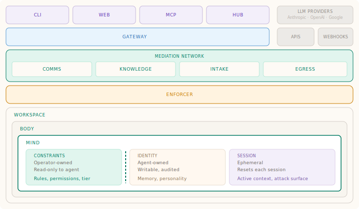

# Agency

[](https://github.com/geoffbelknap/agency/actions/workflows/ci.yml)
[](LICENSE)
[](https://go.dev)

Governed AI agents with real isolation, mediated execution, durable memory, and
complete auditability.

Agency is the reference implementation of [ASK](https://askframework.org), the
open framework for agent security.

## What Agency Is

Agency is a platform for running one or a few AI agents that can do real work
without being trusted with your machine, your network, or your credentials.

The core product is intentionally simple:

- create an agent
- start it in an isolated workspace
- talk to it through a direct-message workflow
- let it use governed tools through a mediation layer
- keep a durable audit trail and visible budget/usage records
- let it build graph-backed context that improves future work

This is not "just another chat UI." The point is the governed runtime around the
agent.

## How It Works



Operators use the CLI, web UI, REST API, or MCP server. The Go gateway is the
control plane and source of truth.

Each agent runs inside its own isolated workspace. An enforcer sidecar mediates
every LLM call, tool call, and service request. The agent never sees real API
keys and never gets direct outbound internet access.

Inside the workspace, Agency implements the
[ASK cognitive model](https://askframework.org/#cognitive):

- `Constraints` are operator-owned and read-only
- `Identity` is agent-owned and durable
- `Session` is ephemeral per run

The system is event-driven. Agents are woken by direct messages, platform
events, and other routed events rather than broad polling loops being the main
product model.

Agency also keeps a durable knowledge graph. The important part of that story is
not "graph features for their own sake," but that agents can retrieve useful
context from previous work and get smarter and faster over time.

## Why It Exists

Most AI agent demos skip the hard parts:

- isolation
- mediation
- credential boundaries
- auditability
- fail-closed behavior
- operator recovery

Those are exactly the parts that matter once an agent is doing real work.
Agency is built around them first.

## Quick Start

**You'll need:**

- [Docker](https://docs.docker.com/get-docker/) installed and running
- an API key from [Anthropic](https://console.anthropic.com),
  [OpenAI](https://platform.openai.com), or
  [Google](https://aistudio.google.com)

> **Windows:** Install
> [Docker Desktop](https://docs.docker.com/desktop/install/windows-install/)
> with WSL integration enabled, then run Agency inside WSL2.

### Install

**macOS / Linux (Homebrew):**

```bash
brew install geoffbelknap/tap/agency
```

**Linux / macOS / WSL2 (script):**

```bash
curl -fsSL https://geoffbelknap.github.io/agency/install.sh | bash
```

### First Run

```bash
agency quickstart
```

Quickstart guides you through:

1. choosing a provider
2. storing an API key
3. starting infrastructure
4. creating a first agent
5. opening the web UI and direct-message chat

After setup, the main path is:

```bash
agency send henry "summarize the open issues in this repo"
agency log henry
agency admin doctor
```

See [docs/quickstart.md](docs/quickstart.md) for the guided flow.

## Programmatic Surface

Agency is not only a CLI and web app. It also exposes a build surface for
operators and other tools:

- REST API
- canonical OpenAPI spec at
  [internal/api/openapi.yaml](internal/api/openapi.yaml)
- supported core API view at `/api/v1/openapi-core.yaml`
- MCP server via `agency mcp-server`

That means Agency itself, its web UI, AI assistants, and third-party clients
can all build on the same contract.

### AI Assistant Integration

Add Agency as an MCP server:

```bash
claude mcp add agency -- agency mcp-server
codex mcp add agency -- agency mcp-server
gh copilot mcp add agency -- agency mcp-server
```

## Core Commands

```text
agency quickstart
agency setup
agency infra up
agency status

agency create <name> [--preset X]
agency start <name>
agency stop <name>
agency show <name>
agency send <agent> <message>
agency log <name>

agency admin doctor
agency admin usage --agent <name>
agency graph query <text>
agency graph stats
```

Run `agency <command> --help` for details.

## What Is In Scope Today

Agency's credible near-term core is:

- governed single-agent or small-agent workflows
- direct messages and simple channels
- event-driven execution
- provider routing and governed tool use
- graph-backed retrieval/context
- audit, budget, and usage visibility
- web UI for setup, agents, DM, and activity
- API and MCP surfaces for builders

There are broader platform areas in the repo, but they are not the center of
the product story right now.

## Building

```bash
make all
make install
make images
make test

go test ./...
pytest images/tests/
```

## Repository Structure

```text
agency/
├── cmd/gateway/        # Go binary entry point
├── internal/           # Go packages: API, CLI, orchestrate, policy, runtime
├── images/             # Container image sources
├── presets/            # Agent preset YAML files
├── web/                # Web UI (REST client)
├── docs/               # Docs, specs, plans
├── go.mod
└── Makefile
```

## Related Projects

| Project | What it is |
|---------|-----------|
| [ASK](https://askframework.org) | The security framework Agency implements. |
| [web/](web/) | The Agency web UI. |
| [agency-hub](https://github.com/geoffbelknap/agency-hub) | Registry and ecosystem work outside the core runtime story. |

## Platform Support

Linux (`x86_64`, `arm64`) and macOS (Apple Silicon, Intel) natively. Windows
via WSL2.

## Contributing

See [CONTRIBUTING.md](CONTRIBUTING.md). All changes must satisfy the
[ASK tenets](https://askframework.org).

## License

Apache 2.0. See [LICENSE](LICENSE).
